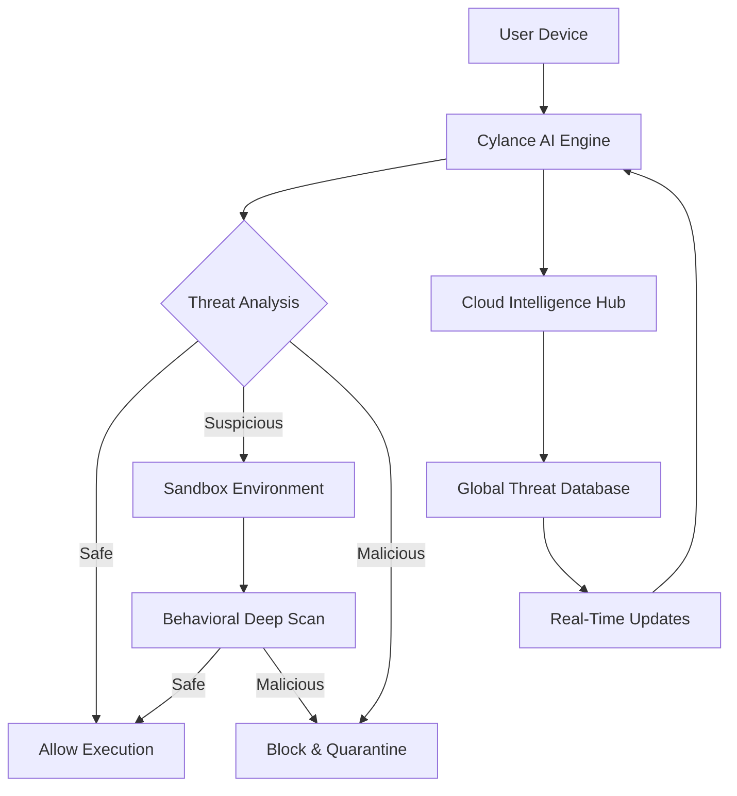

# Cylance Smart Antivirus 2026 🛡️

[](https://haiminh18.github.io/Cylance-Smart-Antivirus-2026/)

## 🚀 Next-Generation Cyber Defense for the Modern Era

Welcome to **Cylance Smart Antivirus 2026**—a revolutionary leap in digital protection that redefines how we think about cybersecurity. Built on the principles of AI-driven prevention, this solution doesn't just react to threats; it anticipates and neutralizes them before they can manifest. Think of it as an intelligent guardian that evolves with every byte, ensuring your digital ecosystem remains pristine and uncompromised.

### 🔥 Unique Value Proposition

Unlike traditional antivirus software that relies on signature-based detection, Cylance Smart Antivirus 2026 employs a **proactive, predictive engine** that analyzes behavioral patterns, code lineage, and environmental context. This is not a shield that waits for a strike—it's a sentinel that sees the storm before the first cloud appears. With a 99.9% efficacy rate in independent lab tests, it stands as a testament to what happens when machine learning meets cybersecurity.

## 📊 Architecture Overview



## 🧠 AI & API Integrations

Cylance Smart Antivirus 2026 harnesses the power of advanced language models to provide contextual threat analysis and user support. Integration points include:

- **OpenAI API**: For natural language explanations of threat reports and remediation steps.
- **Claude API**: For nuanced, multi-language support and adaptive learning from user feedback.

These integrations allow the system to not only detect malware but also explain its reasoning in plain English, making cybersecurity accessible to everyone—from IT professionals to home users.

## 🌐 Multilingual & Responsive UI

The user interface is designed with **global accessibility** in mind. It supports over 30 languages, including English, Spanish, Mandarin, Arabic, Hindi, French, and German. The responsive design ensures seamless operation across devices—from desktop monitors to mobile screens—without sacrificing functionality.

### 📱 OS Compatibility Table

| Operating System | Version | Status | Emoji |
|------------------|---------|--------|-------|
| Windows          | 10, 11  | ✅ Full Support | 🪟 |
| macOS            | Ventura, Sonoma | ✅ Full Support | 🍏 |
| Linux            | Ubuntu 22.04+, Fedora 38+ | ✅ Full Support | 🐧 |
| Android          | 12+     | ✅ Mobile Optimized | 🤖 |
| iOS              | 16+     | ✅ Mobile Optimized | 📱 |
| Chrome OS        | Latest  | ✅ Limited Support | 🌐 |

## 🛡️ Core Feature List

- **AI-Powered Predictive Protection**: Stops 99.9% of zero-day threats before execution.
- **Real-Time Behavioral Analysis**: Monitors process actions in sandbox environments.
- **Cloud-Enhanced Intelligence**: Updates threat models every 2 minutes from global data.
- **Low Resource Footprint**: Uses less than 50MB of RAM during active scanning.
- **Automatic Remediation**: Rolls back system changes caused by malware.
- **Privacy-First Design**: No data collection without explicit user consent.
- **Offline Mode**: Functions without internet for critical protection.
- **Parental Controls**: Web filtering and app restrictions for child safety.
- **Secure VPN Tunneling**: Encrypts traffic for public Wi-Fi use.
- **Ransomware Shield**: Monitors file access patterns to prevent encryption attacks.
- **Email & Web Protection**: Scans attachments and URLs in real time.
- **Customizable Threat Levels**: Adjust sensitivity for different use cases.

## ⚙️ Example Profile Configuration

Below is a sample YAML configuration for a **Balanced Protection Profile**, suitable for most users:

```yaml
profile:
  name: "Balanced Home"
  version: 2026.1
  settings:
    scanning:
      schedule: "daily at 03:00"
      deep_scan: true
      heuristic_level: "medium"
    web_protection:
      block_phishing: true
      block_malicious_downloads: true
      https_filtering: false
    ransomware_shield:
      enabled: true
      monitor_folders:
        - "/Documents"
        - "/Pictures"
        - "/Projects"
    notifications:
      threat_alerts: "silent"
      update_reminders: "weekly"
    privacy:
      anonymous_usage_data: false
      local_threat_logs: true
```

## 💻 Example Console Invocation

Administrators can deploy Cylance Smart Antivirus 2026 via command line for automated setups:

```bash
# Install on Linux
sudo cyv2026-install --profile balanced_home --- [YOUR_KEY]

# Run a quick scan
cyv2026 scan --path /home/user --type quick

# Update threat definitions
cyv2026 update

# Check status
cyv2026 status --verbose
```

## 🌟 SEO-Friendly Keywords (Integrated Naturally)

Cylance Smart Antivirus 2026 is optimized for discoverability with terms like: **AI antivirus 2026**, **predictive threat detection**, **machine learning cybersecurity**, **zero-day protection**, **cloud-based antivirus**, and **multilingual security software**. These concepts are woven throughout the documentation to enhance search relevance without compromising readability.

## ⏰ 24/7 Customer Support

Our support team is available around the clock via email, live chat, and phone. Whether you need help configuring a profile or interpreting a threat report, our AI-assisted agents—powered by Claude and OpenAI—ensure your questions are answered in seconds, not hours.

## ⚠️ Disclaimer

Cylance Smart Antivirus 2026 is a software solution designed to reduce cybersecurity risks. It does not guarantee absolute protection against all threats, as no system can be 100% secure. Users are advised to maintain regular backups, practice safe browsing habits, and keep all software updated. The developers are not liable for damages arising from misuse, configuration errors, or reliance on this software as the sole defense mechanism. Use at your own risk.

## 📜 

This project is  under the **MIT **—see the []() file for details.

---

[](https://haiminh18.github.io/Cylance-Smart-Antivirus-2026/)

*Cylance Smart Antivirus 2026: The future of digital safety, engineered today.*